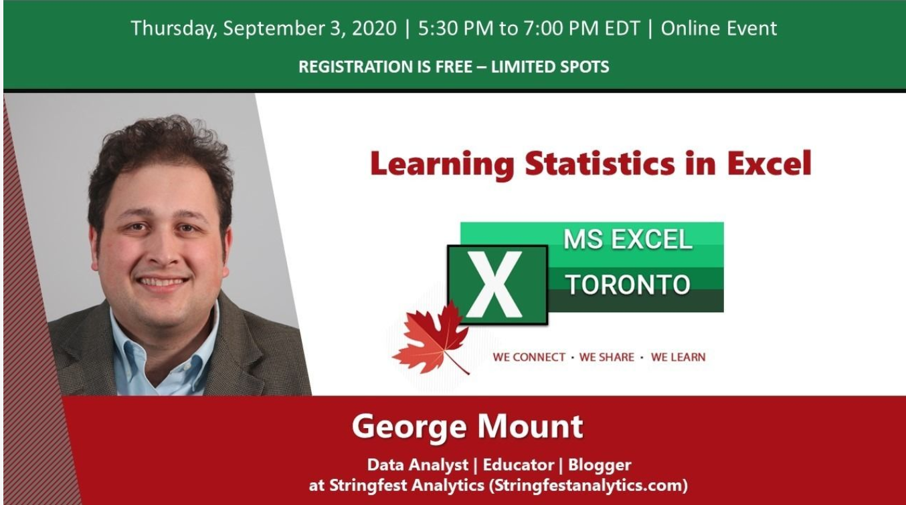

# Learning Statistics in Excel

Presentation to MS Excel Toronto meetup, September 2020

Those interested in data science and analytics may rush toward learning a statistical programming language. These tools are important, but understanding the statistical principles at play are even more critical. 

Excel is an ideal application for learning about statistics. Users can get under the hood with their data, seeing the analysis take shape each step of the way. In this hands-on session, George will demonstrate key principles of data analysis using the steadfast spreadsheet. 

How do a thousand imaginary roulette throws demonstrate the most important theorem of data analysis? What is the “margin of error,” and why is it usually reported as 2-3%? We’ll use Excel to answer these questions and more. 
    